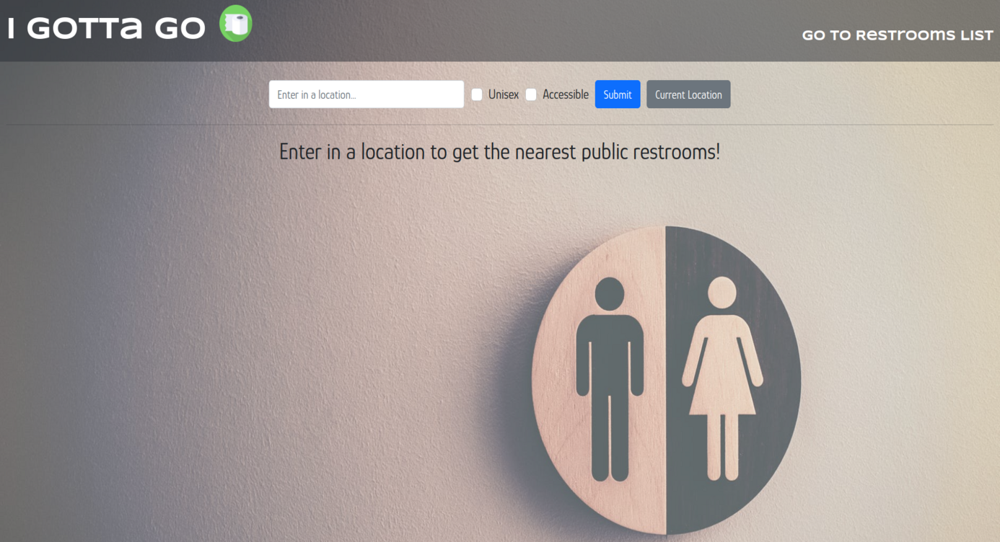
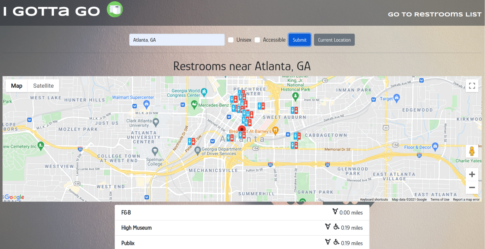
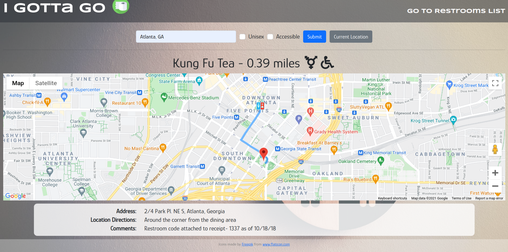

# I Gotta Go

#### By Vanessa Su

#### To see my live website go to https://i-gotta-go-now.herokuapp.com/

## Description

The I Gotta Go web app helps the user find the closest public restrooms to an input or automatically detected location. A list and a map are generated with the results that they can click on to view directions and more information on the restroom.

## User Story

-   As a user I want to be able to input a location into the form
-   As a user I want to be able to choose automation location detection
-   As a user I want to be able to filter my results to only show unisex and/or accessible restrooms
-   As a user I want to hit the Submit button the form to set the location and filter parameters
-   As a user I want to see a list of nearby restrooms once the location is set
-   As a user I want to see a map with pins of the location of the results
-   As a user I want to be able to click on a list item or map marker link to see its details
-   As a user I want to see a map with directions from location when looking at location details

## Technologies Used

-   React
-   Node
-   JavaScript
-   HTML
-   CSS
-   [Refuge Restrooms API](https://www.refugerestrooms.org/api/docs/)
-   [Google Maps API](https://developers.google.com/maps)

## Setup/Installation Requirements

### Prerequisites

-   [Node](https://nodejs.org/en/)
-   A text editor like [VS Code](https://code.visualstudio.com/)
-   [Google Maps API](https://developers.google.com/maps) key

### Installation

1. Clone the repository: `$ git clone https://github.com/vnessa-su/i-gotta-go.git`
2. Navigate to the `/i-gotta-go` directory on your computer
3. Open with your preferred text editor to view the code base
4. To start a development server and view the project in the browser:
    - Navigate to `/i-gotta-go` in your command line
    - Run the command `npm install` to install dependencies
    - Optionally, run the commmand `npm run build` to make a bundle of the files
    - Finally, run the command `npm run start` to start a development server

### Obtain API key

1. Go to [Google Maps API](https://developers.google.com/maps) website
2. Press the `Get started` button
3. Follow the prompts to create an account, set up a project and obtain an API key.
4. Create a .env.local file in the `/i-gotta-go` directory
5. Open the .env.local file in your text editor
6. Add `REACT_APP_GOOGLE_MAPS_API_KEY={Your API Key Here}` to the file, replacing `{Your Api Key Here}` with the API key obtained in step 3

## Known Bugs

-   Weird errors in the console around the Google Map Directions API, possibly something to do with the `@react-google-maps/api `module

## Contact Information

_For any questions or comments, please reach out through GitHub._

## License

[MIT License](license)

Copyright (c) 2021 Vanessa Su
